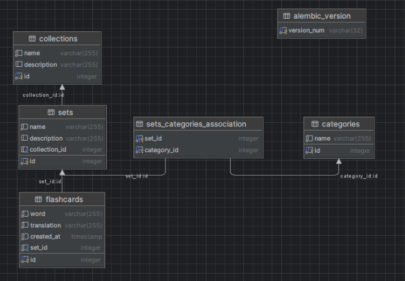

# 🧠 Flashcards Manager (Фінальний проєкт курсу)

## Тема проєкту: Flashcards Manager для вивчення нових мов. Картки для запам’ятовування.
Проєкт для вивчення нових мов за допомогою карток для запам’ятовування слів. Користувач може створювати набори карток (сети), об'єднувати їх у колекції, прив’язувати до категорій, а також виконувати пошук, сортування та інші дії.

## 🧱 Сутності

- **Set** – набір карток (наприклад, "Фрукти", "Ідіоми", "Англійська A2")
- **Flashcard** – окрема картка зі словом/перекладом
- **Collection** – об’єднання кількох сетів
- **Category** – категорія, до якої належить сет (наприклад, "Їжа", "Фрази", "Граматика")

---

## 🗄 Схема бази даних

---

## 🔧 Основний функціонал

- CRUD (створення, читання, оновлення, видалення) **для всіх сутностей**: `Set`, `Flashcard`, `Collection`, `Category`
- **Сортування** карток у сетах:
  - За часом створення (від новіших до старіших)
  - За алфавітом
- **Пошук** карток за словом або його частиною
- **Створення сетів разом із категоріями**
- **Створення категорій разом із сетами**
- **Фільтрація:**
  - Отримати всі сети певної категорії
  - Отримати всі категорії певного сету

---

## ✅ Обов'язкові вимоги виконані

- FastAPI
  - Pydantic (data validation)
  - Dependency Injection (project infrastructure)
- SQLAlchemy - ORM, Alembic - migrations (PostgreSQL DB)