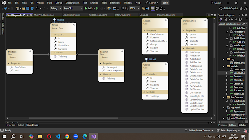
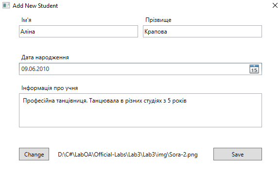
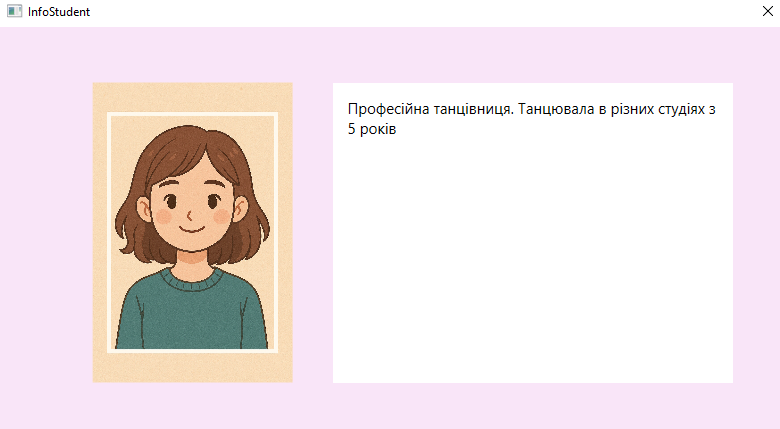
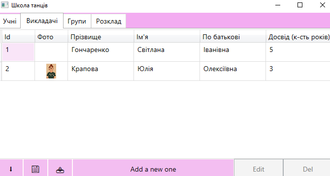
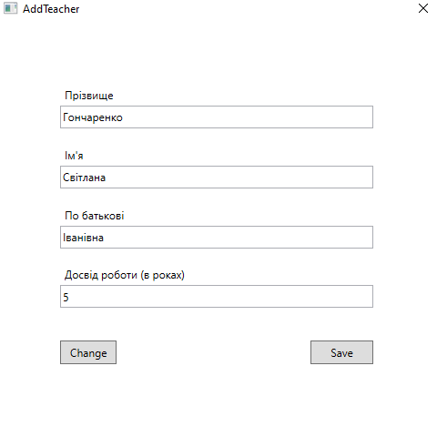
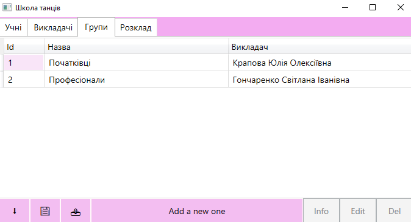
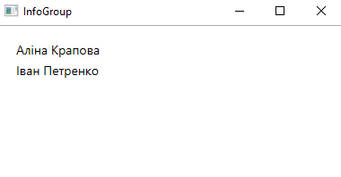
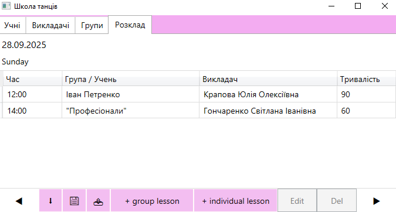
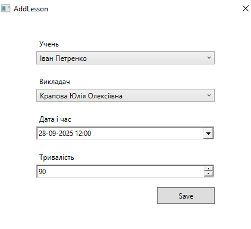

# Лабораторна робота 3 C#

## Звіт до Лабораторної роботи №3  
**Тема:** Основи роботи з формами та файловою системою + ООП  

## Зміст
- [Мета](#мета)
- [Завдання](#завдання)
- [Теоретичні відомості](#теоретичні-відомості)
- [Практична частина](#практична-частина)
- [Висновок](#висновок)
- [Список джерел](#список-джерел)

## Мета
Отримати практичні навички роботи з формами в C#, ознайомитись з основними елементами керування Windows Forms (або WPF) та застосувати принципи об'єктно-орієнтованого програмування при розробці програмного забезпечення.  
Освоїти роботу з формами та файловою системою в C#, навчитися працювати з різними форматами файлів для збереження та завантаження даних.

## Завдання
Розробити систему для автоматизації роботи школи танців. Програма повинна забезпечувати:

- Облік учнів, викладачів, груп, розкладу занять.  
- Відстеження прогресу учнів через вкладку **"Інфо"**.  
- Створення груп (мінімум один викладач).  
- Створення групових та індивідуальних занять.  
- Обмеження: учню повинно бути мінімум **5 років**.  

### Функціональні вимоги:
1. **Робота з файлами різних форматів**  
   - TXT  
   - CSV  
   - XML  
   - JSON  
   - XLSX  

2. **Генерація звітів**  
   - DOCX  
   - PDF  

3. **Інтерфейс користувача**  
   - Відкриття файлів через діалогове вікно  
   - Збереження файлів через діалогове вікно  
   - Генерація звітів  

## Теоретичні відомості
Програма розроблена з використанням **WPF (Windows Presentation Foundation)**.

### Компоненти WPF
- **Головне вікно:**  
  TabControl, Grid, DataGrid, Button  

- **Форми для створення об’єктів:**  
  StackPanel, UserControl (Label + TextBox), ComboBox, DatePicker, NumericUpDown, Button  

- **Інфо-форми:**  
  Grid, Rectangle, ListView  

### Принципи
- SOLID  
- Абстрактний клас `Person`, від якого наслідуються `Student` та `Teacher`.  
- Інтерфейс `IWithId` для пошуку об'єктів за Id.  
- Імпорт/експорт у формати TXT, CSV, XML, JSON, XLSX.  
- Автоматичне збереження/відновлення даних.  

## Практична частина

### Класи:
- Person  
- Student  
- Teacher  
- Group  
- Lesson  
- DanceSchool  

Рис. 1. Діаграма класів.

### Вигляд програми:

Рис. 2. Головне вікно – Учні.

Рис. 3. Створення/Редагування учня.

Рис. 4. Інфо-форма учня.

Рис. 5. Головне вікно – Викладачі.

Рис. 6. Створення/Редагування викладача.

Рис. 7. Головне вікно – Групи.

Рис. 8. Інформація про групу “Професіонали”.

Рис. 9. Головне вікно – Розклад.

Рис. 10. Створення/Редагування заняття.

## Висновок
Отримано практичні навички роботи з елементами керування WPF, взаємодії між формами та файловою системою.  
Програма відповідає вимогам і демонструє базові підходи до побудови зручного інтерфейсу користувача та структури даних у C#.

## Список джерел
- [Робота з WPF (YouTube Playlist)](https://youtube.com/playlist?list=PLih2KERbY1HHOOJ2C6FOrVXIwg4AZ-hk1&si=lo4Rly3n4EdnHz4u)  
